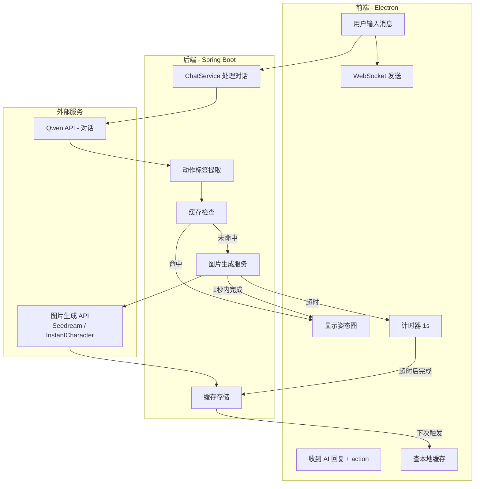
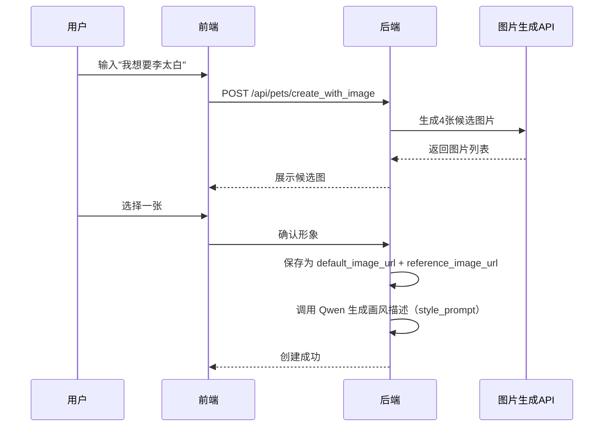
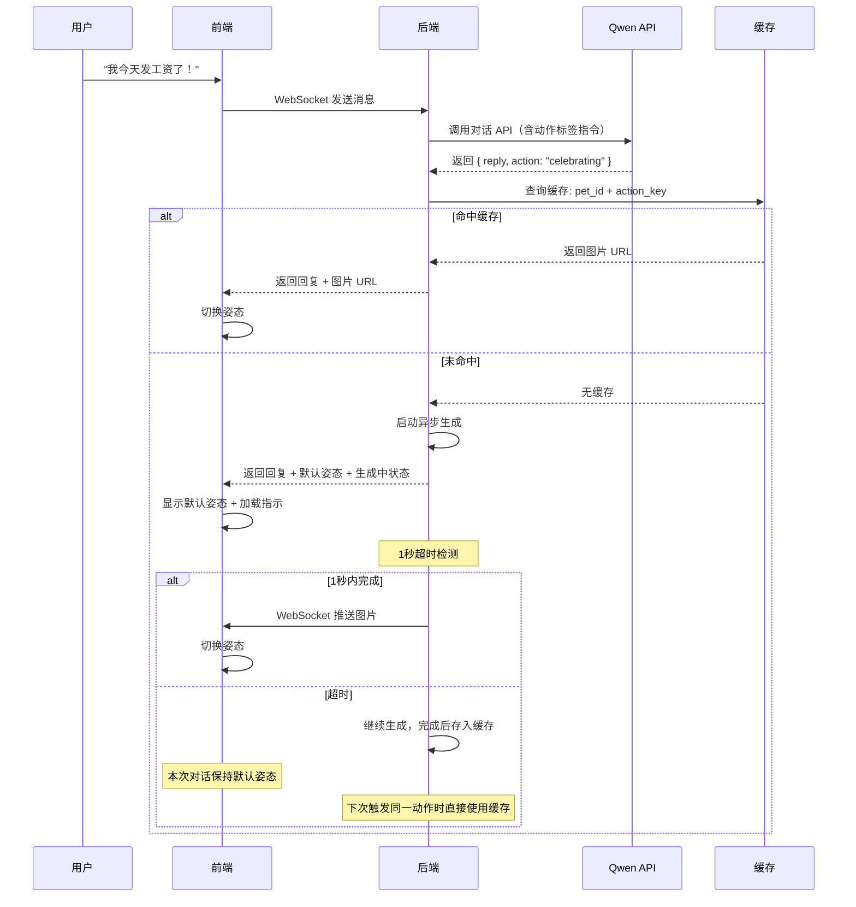
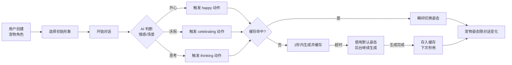

# LumenAmi 宠物动态变化系统设计文档

**版本**：v1.0
**日期**：2026-07-13
**状态**：设计阶段


## 一、设计目标

让 LumenAmi 的宠物能够**根据对话内容自动切换姿态**，实现“有生命感”的动态表现，同时满足：

1. **用户自定义形象**：用户可通过文字描述生成宠物初始形象
2. **对话驱动变化**：AI 回复时带出动作标签，触发姿态切换
3. **实时生成 + 缓存**：新姿态按需生成，超时则缓存复用，体验不中断
4. **画风一致**：生成的姿态图保持与初始形象一致的画风和角色身份


## 二、整体架构




## 三、核心数据模型

### 3.1 宠物表（已有，增加字段）

```sql
ALTER TABLE pets ADD COLUMN default_image_url VARCHAR(255) COMMENT '默认形象图片';
ALTER TABLE pets ADD COLUMN style_prompt VARCHAR(500) COMMENT '画风描述（如：水墨风、二次元）';
ALTER TABLE pets ADD COLUMN reference_image_url VARCHAR(255) COMMENT '参考图锚点（用于保持一致性）';
```

### 3.2 宠物动作缓存表（新增）

```sql
CREATE TABLE pet_actions (
    id INT PRIMARY KEY AUTO_INCREMENT,
    pet_id INT NOT NULL,
    action_key VARCHAR(50) NOT NULL,          -- 如 'celebrating', 'thinking', 'nodding'
    image_url VARCHAR(255) NOT NULL,          -- 缓存图片路径
    generated_at TIMESTAMP DEFAULT CURRENT_TIMESTAMP,
    last_used_at TIMESTAMP,
    use_count INT DEFAULT 0,
    FOREIGN KEY (pet_id) REFERENCES pets(id) ON DELETE CASCADE,
    UNIQUE KEY uk_pet_action (pet_id, action_key)
);
```

### 3.3 动作标签定义

| action_key | 中文描述 | 触发场景 |
|---|---|---|
| `idle` | 待机 | 默认状态 |
| `happy` | 开心 | 用户分享好消息 |
| `thinking` | 思考 | 用户提问复杂问题 |
| `nodding` | 点头 | 表示赞同 |
| `celebrating` | 庆祝 | 用户达成目标 |
| `sad` | 难过 | 用户表达负面情绪 |
| `questioning` | 疑惑 | 用户表达困惑 |
| `drinking` | 举杯 | 庆祝、放松场景 |


## 四、流程详解

### 4.1 阶段一：角色创建



**关键接口**：

```
POST /api/pets/create_with_image
请求体：
{
  "name": "李太白",
  "roleName": "李白",
  "systemPrompt": "你是一位豪放的诗人...",
  "imagePrompt": "中国风, 李白, 诗人, 水墨风格"
}

响应：
{
  "petId": 1,
  "candidates": ["url1", "url2", "url3", "url4"],
  "stylePrompt": "中国传统水墨画风格，毛笔笔触，宣纸质感"
}
```

### 4.2 阶段二：对话触发姿态变化



### 4.3 阶段三：图片生成（超时缓存机制）

```java
// ChatService.java - 核心逻辑
public ChatResponse processMessage(Integer petId, String userMessage) {
    // 1. 调用 Qwen API，要求返回 action 标签
    QwenResponse qwenResp = qwenService.chatWithAction(userMessage);
    
    // 2. 检查缓存
    String cachedImage = petActionMapper.findCachedImage(petId, qwenResp.getAction());
    if (cachedImage != null) {
        // 命中缓存，直接返回
        return ChatResponse.builder()
            .reply(qwenResp.getReply())
            .action(qwenResp.getAction())
            .imageUrl(cachedImage)
            .isCached(true)
            .build();
    }
    
    // 3. 未命中，异步生成
    String defaultImage = petMapper.getDefaultImage(petId);
    
    // 异步生成
    CompletableFuture<String> future = CompletableFuture.supplyAsync(() -> {
        return imageGenerationService.generatePose(
            petId,
            qwenResp.getAction(),
            petMapper.getReferenceImage(petId),
            petMapper.getStylePrompt(petId)
        );
    });
    
    // 4. 1秒超时检测
    try {
        String imageUrl = future.get(1, TimeUnit.SECONDS);
        // 1秒内完成，保存缓存并返回
        saveToCache(petId, qwenResp.getAction(), imageUrl);
        return ChatResponse.builder()
            .reply(qwenResp.getReply())
            .action(qwenResp.getAction())
            .imageUrl(imageUrl)
            .isCached(false)
            .build();
    } catch (TimeoutException e) {
        // 超时：继续生成，当前对话使用默认姿态
        future.thenAccept(imageUrl -> {
            saveToCache(petId, qwenResp.getAction(), imageUrl);
        });
        return ChatResponse.builder()
            .reply(qwenResp.getReply())
            .action(qwenResp.getAction())
            .imageUrl(defaultImage)
            .isCached(false)
            .isGenerating(true)
            .build();
    }
}
```


## 五、图片一致性生成方案

### 5.1 技术选型

| 方案 | 优点 | 缺点 | 适用场景 |
|---|---|---|---|
| **InstantCharacter + 固定风格 LoRA** | 开源、可控 | 需自部署 | 完全自建 |
| **豆包 Seedream 5.0** | 官方 API、一致性强、支持流式 | 按量付费 | 快速集成 |
| **Stable Diffusion + ControlNet + IP-Adapter** | 完全可控 | 需配置 LoRA | 高自定义 |

### 5.2 画风一致性保证（以 Seedream 为例）

```java
// ImageGenerationService.java
public String generatePose(Integer petId, String action, String refImageUrl, String stylePrompt) {
    String prompt = String.format(
        "%s，角色正在%s，动态姿态，保持原角色形象特征，画风统一",
        stylePrompt,
        getActionDescription(action)
    );
    
    // 调用 Seedream API，传入参考图
    SeedreamRequest request = SeedreamRequest.builder()
        .referenceImage(refImageUrl)
        .prompt(prompt)
        .strength(0.85)           // 保持与原图相似度
        .styleRef(stylePrompt)    // 风格参考
        .build();
    
    return seedreamClient.generate(request);
}
```

### 5.3 动作描述映射

```java
private String getActionDescription(String action) {
    Map<String, String> actionMap = new HashMap<>();
    actionMap.put("celebrating", "举杯庆祝，面带笑容");
    actionMap.put("thinking", "手托下巴，若有所思");
    actionMap.put("nodding", "点头表示赞同");
    actionMap.put("happy", "开心地微笑");
    actionMap.put("questioning", "歪头表示疑惑");
    actionMap.put("sad", "低头伤感");
    // ...
    return actionMap.getOrDefault(action, "站立姿态");
}
```


## 六、缓存策略

### 6.1 存储结构

| 字段 | 说明 |
|---|---|
| `pet_id + action_key` | 唯一键 |
| `image_url` | 生成的图片 URL（存储在本地或 OSS） |
| `use_count` | 使用次数，用于淘汰决策 |
| `last_used_at` | 最后使用时间 |

### 6.2 淘汰策略

| 策略 | 说明 |
|---|---|
| **LRU** | 当缓存总数超过 50 张/宠物时，淘汰 `last_used_at` 最早的 |
| **LFU** | 淘汰 `use_count` 最低的 |
| **手动清理** | 用户可清空某宠物的所有缓存 |


## 七、前端交互流程

```javascript
// frontend/src/renderer/floating/renderer.js
class PetPoseManager {
    constructor(petId) {
        this.petId = petId;
        this.currentPose = 'idle';
        this.cache = new Map();
        this.defaultImage = null;
    }

    onMessageReceived(data) {
        const { reply, action, imageUrl, isCached, isGenerating } = data;
        
        // 显示回复文本
        this.showReply(reply);
        
        // 处理姿态切换
        if (isGenerating) {
            // 生成中，保持当前姿态
            this.showGeneratingIndicator();
            return;
        }
        
        if (imageUrl) {
            this.switchPose(action, imageUrl);
            if (!isCached) {
                // 新生成的图片，加入本地缓存
                this.cache.set(action, imageUrl);
            }
        }
    }

    switchPose(action, imageUrl) {
        this.currentPose = action;
        // 图片切换动画：淡出 → 更换图片 → 淡入
        const petElement = document.getElementById('pet');
        petElement.style.transition = 'opacity 0.3s';
        petElement.style.opacity = '0';
        
        setTimeout(() => {
            petElement.src = imageUrl;
            petElement.style.opacity = '1';
        }, 300);
    }
}
```


## 八、性能优化建议

| 优化点 | 方案 |
|---|---|
| **预生成常用动作** | 用户选定形象后，后台预生成 `idle`、`happy`、`thinking` 三种常见姿态 |
| **图片压缩** | 存储时压缩为 WebP 格式，减少加载时间 |
| **CDN 加速** | 图片上传到 OSS + CDN，加速加载 |
| **渐进式加载** | 先显示低分辨率缩略图，再加载高清图 |


## 九、用户视角的完整流程




## 十、总结

LumenAmi 的宠物动态变化系统通过**“对话驱动 + 按需生成 + 缓存复用”**的机制，实现了：

- ✅ 用户自定义初始形象
- ✅ AI 回复自动触发姿态切换
- ✅ 图片在 1 秒内返回则即时切换，超时则存入缓存下次使用
- ✅ 画风通过固定风格描述 + 参考图锚点保持统一
- ✅ 用户体验不中断，越用越流畅

这套方案让 LumenAmi 的宠物从“静态图片”进化为“有生命感的动态伙伴”，同时避免了传统动作库的设计开销和实时生成的延迟问题。